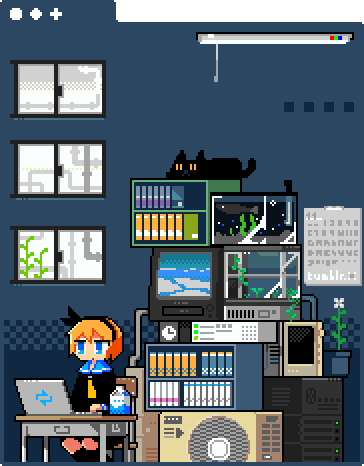

  <h1 align="left"> Hey, nice to see you.&nbsp;&nbsp;&nbsp;&nbsp;&nbsp;&nbsp;&nbsp;&nbsp;&nbsp;&nbsp;&nbsp;&nbsp;&nbsp;&nbsp;&nbsp;&nbsp;&nbsp;&nbsp;&nbsp;&nbsp;My&nbsp;&nbsp;&nbsp; &nbsp;Visitors</h1> 

  <a href="https://github.com/RookieXwc" class="rich-diff-level-one">
    
    <!-- &hide=issues
    
    -->
  </a>
  

